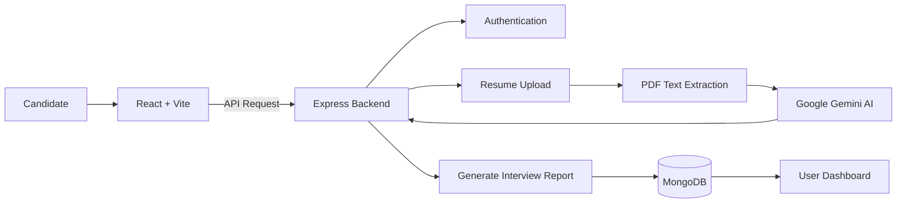

# PrepPilot — AI-Powered Interview Preparation Assistant


## Project Overview

PrepPilot is an AI-powered interview preparation platform designed to help candidates prepare for technical and HR interviews in a smarter and more personalised way.

The platform analyses a candidate's resume and target job requirements, then uses Generative AI (Google Gemini) to create a customised interview preparation report. Instead of manually searching for possible interview questions and preparation resources, candidates can get role-specific insights, expected questions, and preparation guidance automatically.

PrepPilot bridges the gap between a candidate's current skills and the expectations of a specific job role.

## Features

- AI-powered personalised interview preparation reports
- Resume analysis and skill extraction
- Job description analysis and role matching
- Technical interview question generation
- HR and behavioural interview preparation
- User authentication and account management
- Save, view, and manage previous interview reports

## How It Works

1. Candidate creates an account and logs in
2. Candidate uploads their resume in PDF format
3. Candidate provides the target job description
4. Backend extracts resume information from the uploaded file
5. Google Gemini AI analyses the resume and job requirements
6. AI generates a personalised interview preparation report
7. Report is stored in MongoDB and can be accessed later

## Tech Stack

### Frontend
- React
- Vite
- Tailwind CSS
- Axios

### Backend
- Node.js
- Express.js
- MongoDB
- Mongoose

### AI
- Google Gemini API

## High-level architecture



## Folder structure
- `frontend/` — React app
- `server/` — Express backend (API)
- `docs/` — generated documentation (frontend & backend)

## Frontend overview
See the frontend README and docs:
- [frontend/README.md](frontend/README.md)
- [docs/frontend/ARCHITECTURE.md](docs/frontend/ARCHITECTURE.md)
- [docs/frontend/ROUTING.md](docs/frontend/ROUTING.md)
- [docs/frontend/API_INTEGRATION.md](docs/frontend/API_INTEGRATION.md)

## Backend overview
See the backend README and docs:
- [server/README.md](server/README.md)
- [docs/backend/ARCHITECTURE.md](docs/backend/ARCHITECTURE.md)
- [docs/backend/API_REFERENCE.md](docs/backend/API_REFERENCE.md)
- [docs/backend/AUTHENTICATION.md](docs/backend/AUTHENTICATION.md)

## Installation
Install dependencies for both frontend and backend.

```bash
# from repository root
cd frontend
npm install

cd ../server
npm install
```

## Environment variables
Backend requires (see `server/.env` and `docs/backend/SETUP.md`):
- `MONGO_URI` — MongoDB connection string
- `JWT_SECRET` — JWT signing secret
- `GOOGLE_GENAI_API_KEY` — Google GenAI API key
- `NODE_ENV` — set to `production` when deployed

Frontend optionally supports:
- `VITE_API_URL` — override backend API base (defaults to `http://localhost:3000/api`)

## Running locally
Start the backend and frontend in separate terminals.

```bash
# from repo root
cd server
npm run start

cd ../frontend
npm run dev
```

Open the frontend (Vite) URL shown in the terminal (typically `http://localhost:5173`).

## Deployment
- Backend: environment variables must be set (MONGO_URI, JWT_SECRET, GOOGLE_GENAI_API_KEY). Serve with a process manager (PM2) or containerize.
- Frontend: build with `npm run build` and serve static files via CDN or static host.

## API overview
Base API path: `/api` (configurable in the frontend via `VITE_API_URL`). Full API reference: [docs/backend/API_REFERENCE.md](docs/backend/API_REFERENCE.md)

## Development workflow
- Create a feature branch from `main`.
- Run the app locally (backend + frontend).
- Open a PR with a descriptive title and link to any tickets.

## Contribution guide
- Keep changes focused and test manually (no automated tests present).
- Update documentation under `docs/` when adding endpoints or changing behavior.
- Rotate or remove any real API keys from `.env` before committing.

## Useful links
- Backend README: [server/README.md](server/README.md)
- Frontend README: [frontend/README.md](frontend/README.md)
- Backend docs: [docs/backend](docs/backend)
- Frontend docs: [docs/frontend](docs/frontend)
