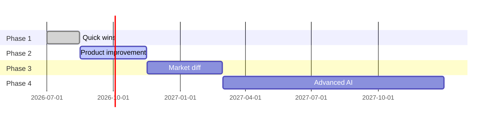

# Competitive Feature Roadmap — PrepPilot

Purpose
- This document recommends concrete, prioritized features to make PrepPilot highly competitive with modern AI interview-prep platforms. Recommendations are specific to the current React + Express + MongoDB + Gemini architecture and focus on features that deliver measurable user value.

How to read this
- Features are grouped by estimated development effort: Easy, Moderate, Hard/Advanced.
- For each feature we show the user problem, benefits, and the concrete frontend/backend/database/AI changes required.

=================================================================
## Current baseline (what PrepPilot already does)
- Authenticated user accounts with cookie-based JWT sessions
- Resume upload (PDF) in-browser, multipart POST to backend
- Backend extracts resume text with `pdf-parse` and calls Google GenAI (Gemini) via `@google/genai`
- AI returns a validated structured interview report saved in MongoDB
- Frontend shows lists, report view, progress UI, and client-side form validation

Current limitations to address
- Single-resume-per-session (no persistent multiple resume support)
- Limited analytics and history insights for users
- No export/share or advanced collaboration features
- No interactive or simulated interview capability
- PII in stored `resume` field — privacy considerations

=================================================================
## Easy Features (Low Development Effort)
These are high-impact, low-effort features that can be implemented using existing endpoints, UI patterns and the AI service with minimal schema changes.

1) Export report as PDF
- Description: Client-side export of the generated interview report to a styled PDF (print-friendly). Include options: full report, questions-only, roadmap-only.
- User problem solved: Users need a shareable, printable artifact for interview preparation or sharing with mentors.
- User benefit: Easy offline review, printing, and sharing with others or recruiters.
- Why it improves PrepPilot: Increases perceived professionalism and usability; parity with competitors that provide downloads.
- Frontend changes: Add “Export” action on `InterviewPrep` view that renders a print stylesheet or generates PDF via `window.print()` or a library (`html2pdf`, `jsPDF`, or server-side PDF generation endpoint). Add UI modal for export options.
- Backend changes: Optional — none if client-side; add a server-side endpoint `/api/reports/:id/export` if higher fidelity PDFs are required (server-side rendering using Puppeteer/Headless Chrome).
- Database changes: none
- AI changes: none
- Estimated complexity: Low (1-2 developer days if client-side; 3-5 days for server-side polished PDF)

2) Save favourite / bookmark question
- Description: Let users mark individual questions (technical/behavioral) as favorites and surface a personal “favourites” list.
- User problem solved: Users want to curate questions for targeted practice and quick review.
- User benefit: Faster study sessions and personalization.
- Why it improves PrepPilot: Increases retention and makes the product sticky.
- Frontend changes: Add favorite controls in `ReportView` and a new “Favourites” section in `Profile` or Dashboard.
- Backend changes: Add endpoints: `POST /api/user/favorites` (add), `DELETE /api/user/favorites/:id` (remove), `GET /api/user/favorites` (list) — controlled by authenticated user.
- Database changes: Add a `favorites` array to `users` model referencing `{ reportId, questionIndex, kind, metadata }` or a new `favorites` collection keyed by user.
- AI changes: none
- Estimated complexity: Low–Medium (2-3 days)

3) In-report checklist / quick practice checklist
- Description: Derive a simple, actionable checklist from the AI report (top 5 gaps, top 3 questions to rehearse, daily checklist of tasks) and show it in the Dashboard.
- User problem solved: Users need an immediate, digestible action-plan rather than a long report.
- User benefit: Improves adoption — quick wins that users can complete in short sessions.
- Why it improves PrepPilot: Converts reports into actionable micro-tasks, increasing engagement.
- Frontend changes: Add a new `Checklist` UI component, show on Dashboard and Report pages, allow marking tasks complete locally and syncing to server.
- Backend changes: Endpoint to save checklist progress `POST /api/checklist` and `GET /api/checklist` (small payload per user-report).
- Database changes: Minimal: `checklists` collection or add `checklist` subdocument to `InterviewReport` (lightweight tasks with completion flags per user).
- AI changes: none (derive checklist from returned fields on the client or server using a small templating function). Optionally request checklist from Gemini for better phrasing.
- Estimated complexity: Low–Medium (2-4 days)

4) Improved report formatting and “summary card” for Dashboard
- Description: Show a concise summary for each report (score, top gaps, top 3 questions) on the dashboard tiles and in the ReportCard component.
- User problem solved: Users want to scan results quickly and prioritize reports.
- User benefit: Faster triage and improved UX.
- Why it improves PrepPilot: Better UX; makes Dashboard more useful at a glance.
- Frontend changes: Enhance `ReportCard` and Dashboard components to display summary snippets and clickable quick actions.
- Backend changes: none — use existing report fields; add small lightweight endpoint `GET /api/interview?summary=true` if server-side aggregation preferred.
- Database changes: none
- AI changes: none
- Estimated complexity: Low (1-2 days)

5) Improved notifications & retry guidance for AI failures
- Description: Surface clearer, contextual notifications when AI service returns retryable errors (503/429) with suggested retry intervals and tips.
- User problem solved: Users see opaque errors and may retry blindly.
- User benefit: Reduced confusion; better guidance during transient outages.
- Why it improves PrepPilot: Increases reliability perception and reduces support requests.
- Frontend changes: Improve error UI in `JobAnalysis` to show `err.retryable` tips and “Try again in X seconds” countdown.
- Backend changes: Ensure `AiServiceError` sets `retryable` and status for frontend to consume (already implemented); optionally include `retryAfter` headers.
- Database changes: none
- AI changes: none
- Estimated complexity: Low (1-2 days)

=================================================================
## Moderate Features (Medium Development Effort)
These add meaningful product differentiation and require moderate architecture changes or new workflows.

1) Multiple resume support (profile-level resume management)
- Description: Store multiple resumes per user, allow naming them, re-use across analyses, and attach metadata (role, last-used).
- User value: Supports targeted applications and A/B testing of resume versions.
- Competitive advantage: Users can manage resumes in-app rather than re-uploading each session.
- Technical implementation approach: Add resume management CRUD endpoints; store resumes either as files in object storage (S3) or store the uploaded PDF in MongoDB GridFS or a minimal file store and keep metadata in MongoDB.
- Required changes:
  - Frontend: Resume manager UI (list, upload, delete, set active resume)
  - Backend: `/api/resumes` endpoints for upload/download/list/delete
  - DB: new `resumes` collection referencing user and storing metadata + storage pointer
  - Storage: S3 or GridFS integration (Ops)
- Complexity: Medium (1-2 sprints depending on storage approach)

2) Interview readiness score + historical trend
- Description: Aggregate match scores across reports to compute an “interview readiness” score; show a trendline over time and per-skill progress.
- User value: Shows progress and motivates continuous improvement.
- Competitive advantage: Data-driven coaching and progress visualization.
- Technical implementation approach:
  - Compute daily aggregates and keep a per-user `metrics` document (or compute on read for small scale).
  - Frontend: add chart component on `Profile` / Dashboard (small sparkline + percent change).
  - Backend: endpoint `GET /api/metrics` or extend `GET /api/interview` to return aggregates.
  - DB: store minimal `metrics` collection or derive from `InterviewReport` timestamps and `matchScore`.
- AI changes: none
- Complexity: Medium (1-3 weeks - frontend charting + backend aggregation)

3) Company-specific preparation (company + role tuning)
- Description: Accept company name/URL or job posting link and tune the AI prompt to include company-specific context (culture, stack, common interview formats). Optionally fetch public Glassdoor/StackOverflow info to augment prompts.
- User value: Prepares candidates for company-specific expectations and common question patterns.
- Competitive advantage: More realistic preparation and higher perceived value vs generic reports.
- Technical implementation approach:
  - Frontend: add company field in JobAnalysis form and an optional “fetch job posting” step.
  - Backend: augment AI prompt with company context; implement a lightweight scraper or use existing job URL to fetch job text (be cautious about scraping legality and rate limits).
  - DB: store company metadata in `InterviewReport.company`.
  - AI: expand prompt templates and potentially perform two-step generation (company-specific phrasing then report schema extraction).
- Complexity: Medium-High (requires safe web-fetching, prompt engineering; ~2-4 weeks)

4) Answer improvement assistant (iterative answer polishing)
- Description: Allow users to paste their draft answers to generated questions and have Gemini polish them to be concise, STAR-structured, or tailored to the role.
- User value: Helps candidates craft better interview responses and practice.
- Competitive advantage: Personalised practice and answer quality improvement.
- Technical implementation approach:
  - Frontend: Add an “Improve my answer” action in `ReportView` that opens an editor & submits to backend.
  - Backend: New endpoint `POST /api/assist/answer` that calls Gemini with a specific response schema (polished answer, bullets, time estimate).
  - DB: optionally save improved answers as `userAnswers` linked to reports.
  - AI: design targeted prompt + schema for answer enhancement.
- Complexity: Medium (1-3 weeks; depends on iterative UX)

5) Job tracking + application log
- Description: Let users attach a report to a tracked job application with status (applied, interviewed, offer), notes, and dates.
- User value: Keeps job search organised; ties reports to outcomes.
- Competitive advantage: Targets active job seekers with end-to-end workflow.
- Technical implementation approach:
  - Frontend: Job tracker UI and per-job timeline
  - Backend: `jobs` endpoints and models linking to `InterviewReport` and user
  - DB: new `jobs` collection
  - AI: optional — generate tailored cover notes from resume + JD
- Complexity: Medium (2-4 weeks)

=================================================================
## Hard / Advanced Features (High Development Effort)
Long-term platform features that position PrepPilot as a market leader.

1) AI mock interview simulator (text + timed flow)
- Description: Interactive, multi-round mock interviews where Gemini plays the interviewer, asks follow-ups, and scores answers in real-time; provide post-session feedback and highlight missed points.
- Market advantage: Strong product differentiation; closest to real interview practice.
- User impact: Dramatically better preparation; improves recall under pressure.
- Technical challenges:
  - Low-latency, stateful multi-turn sessions
  - Scoring rubric validation and explainable feedback
  - UX for timed answers and recording responses
- Architecture changes required:
  - Backend: new `sessions` API for creating stateful interview sessions, session store (Redis) for ephemeral conversation state
  - Frontend: real-time UI for prompts, timers, and answer submission; session resume support
  - DB: store session summaries and scored transcripts in `interviewSessions` collection
  - Infrastructure: Redis or similar for ephemeral state
- AI requirements:
  - Multi-turn dialog with context window management; system prompts to control interviewer persona and difficulty
  - Response validation and automated scoring using a rubric or separate Gemini calls
- Complexity: High (2-4+ months)

2) Voice-based AI interviewer (speech in/out)
- Description: Allow voice interviews with synthesized interviewer voice and speech-to-text for candidate responses; return feedback including speech clarity and answer content.
- Market advantage: Simulates phone/onsite interviews; unique and high-fidelity practice.
- User impact: Builds verbal fluency, reduces interview anxiety.
- Technical challenges:
  - Integrating STT (speech-to-text) and TTS (text-to-speech) with Gemini
  - Handling network latency, transcript accuracy and punctuation
  - Privacy and storage of audio (consent and retention policies)
- Architecture changes:
  - Backend: streaming endpoints or WebSocket gateway to accept audio chunks; store transcripts in session store; integrate third-party STT/TTS (Google Cloud Speech, etc.)
  - Frontend: media capture, playback, client-side buffering, and UI for recording
  - DB: store transcripts and optionally short audio clips with user consent
  - Infra: increase bandwidth, consider serverless transcode
- AI requirements: multimodal pipeline; Gemini + STT/TTS; post-processing to align timestamps
- Complexity: Very High (3-6+ months)

3) Real-time interview feedback with video analysis
- Description: Record video mock interviews and provide feedback on content, tone, posture and eye-contact using a combination of Gemini for content and ML models for visual cues.
- Market advantage: Premium differentiator for advanced coaching.
- User impact: High — actionable non-verbal feedback.
- Technical challenges:
  - Video processing and CV models for posture/eyes/scoring
  - Privacy and consent; heavy compute for analysis
  - UX for uploading and reviewing annotated timelines
- Architecture changes required:
  - Backend: video ingestion, job queue, GPU or serverless ML pipelines
  - Frontend: record/segment video, upload, and show annotated playback
  - DB: store analysis artifacts and timestamps
  - Infra: heavy compute and storage planning
- AI requirements: multimodal pipelines, specialized CV models, and Gemini for content suggestions
- Complexity: Very High (6+ months; enterprise-focused)

4) Adaptive interview difficulty and long-term progress tracking
- Description: Personalised adaptive curriculum that increases question difficulty as the user improves; long-term tracking and cohort benchmarking.
- Market advantage: Learning science-driven product with retention and paid-upgrade potential.
- User impact: Sustained improvement and clear progression metrics.
- Technical challenges:
  - Defining difficulty taxonomy and mapping AI outputs to difficulty levels
  - Adaptive scheduling algorithms and spaced repetition
  - Storing longitudinal signals and computing cohorts
- Architecture changes:
  - Backend: curriculum engine, scheduling jobs, and analytics pipelines
  - DB: additional collections for user progress, attempt logs, and difficulty metadata
  - AI: controlled prompt templates for different difficulty levels and scoring
- Complexity: Very High (months; research & iteration)

=================================================================
## Competitor Analysis

What existing platforms typically provide
- Generic question banks and curated content (free/paid)
- Guided mock interviews (some with human coaches)
- Automated question generation and answer grading (varies in quality)
- Some platforms offer voice-based practice or video review (usually paid tiers)

Where PrepPilot can differentiate (USPs)
- Personalisation from resume + job description pairing — produce role-specific questions and a prep roadmap (unique when combined with company-specific tuning).
- Answer improvement assistant — iterative polishing and role-specific tailoring (fast feedback loop for written answers).
- Lightweight, integrated flow: upload resume, paste JD, generate and save report in one request — low friction.

Which features can become PrepPilot USPs
- Company-specific preparation + job-link ingestion (sourced JD enrichment) — stronger signal than generic question banks.
- AI mock interview simulator with automated scoring — differentiator if executed well.
- Answer polishing + saved mentorable responses (favourites + personal notes) — practical daily value.

=================================================================
## Feature Priority Matrix

| Feature | Difficulty | User Impact | Competitive Advantage | Priority |
|---|---:|---:|---|---|
| Export report as PDF | Low | Medium | Convenience | Must Have |
| Save favourite questions | Low | Medium | Retention | Should Have |
| Checklist / Quick actions | Low | High | Engagement | Must Have |
| Improved report formatting | Low | Medium | UX polish | Must Have |
| Better AI-failure UX | Low | Medium | Reliability | Must Have |
| Multiple resume support | Medium | High | Usability | Should Have |
| Readiness score & trends | Medium | High | Insights | Should Have |
| Company-specific prompts | Medium-High | High | Differentiation | Should Have |
| Answer improvement assistant | Medium | High | Value-add | Should Have |
| Job tracking | Medium | Medium | Workflow | Should Have |
| AI mock interview simulator | High | Very High | Major Differentiator | Future Vision |
| Voice-based interviewer | Very High | Very High | Premium Feature | Future Vision |
| Video interview analysis | Very High | Very High | Enterprise-grade | Future Vision |
| Adaptive curriculum & tracking | Very High | Very High | Long-term retention | Future Vision |

=================================================================
## Recommended Development Roadmap

Phase 1 — Quick wins (0–6 weeks)
- Export report as PDF (client-side) — deliver immediate shareability
- Improved report formatting and Dashboard summary cards
- Checklist / quick practice tasks derived from reports
- Better AI-failure UX with retry guidance

Phase 2 — Product improvement (1–3 months)
- Save favourites and lightweight user answers storage
- Multiple resume management (S3/GridFS) and resume selector UI
- Interview readiness score and trendline on the Profile/Dashboard
- Answer improvement assistant (server endpoint + UI flows)

Phase 3 — Market differentiation (3–6 months)
- Company-specific tuning (job link ingestion and company prompt augmentation)
- Job tracking UI and linking reports to applications
- Expand analytics and cohort benchmarking for power users

Phase 4 — Advanced AI platform (6+ months)
- AI mock interview simulator (text first, then voice)
- Voice-based interviewer and STT/TTS pipeline
- Video interview analysis and multimodal feedback
- Adaptive curriculum engine and spaced repetition scheduling

=================================================================
## KPIs & Success Metrics (how to measure)
- Activation: % of users who generate at least one report within 7 days of signing up
- Retention: 7/30-day retention after first report
- Engagement: average # of checklist items completed per user per report
- Conversion (if paid tier): upgrade % after adding advanced features (mock interviews, voice)
- Reliability: % of successful report generations vs retryable AI failures

=================================================================
## Implementation notes & risks
- Privacy: stored resume text may contain PII — before adding uploads-as-storage or exports, add explicit consent and retention policies.
- Cost: Gemini calls are billable; track and limit frequency (rate-limit, quotas) to avoid runaway costs.
- Scalability: advanced features (mock sessions, voice/video) require ephemeral session stores (Redis) and potentially GPU/ML infra.
- Legal & scraping: company-specific job ingestion must comply with site terms — prefer user-provided URLs or integrations with authorized job posting APIs.

=================================================================
## Final recommendation
- Immediate priority: implement Phase 1 (quick wins) to raise perceived product quality and retention.
- Near-term: build Phase 2 features to boost personalization and repeat usage.
- Long-term: invest in Phase 4 only after product-market fit with paid tiers or enterprise customers — mock interviews and multimodal analysis are high ROI but high cost.

If you’d like, I can convert selected roadmap items into scoped tickets with acceptance criteria and estimated story points for sprint planning.
