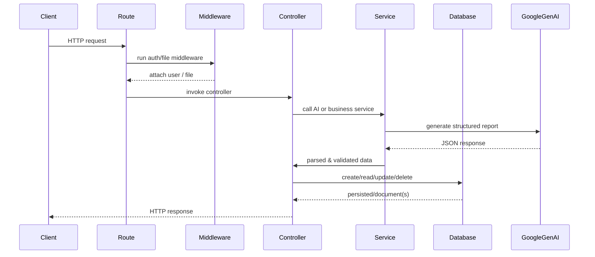

**Architecture**

Overview
- The backend is a lightweight Express.js service written using ES modules and Mongoose for MongoDB.
- Responsibilities: authentication, PDF resume ingestion, calling the AI service to generate structured interview reports, storing and retrieving reports.

Components
- Client (frontend) — communicates over HTTP with JSON payloads and cookies for auth.
- Express API server — routing, middleware, controllers.
- AI service — `src/services/ai.service.js` calls Google GenAI (Gemini) to produce structured JSON validated by `zod`.
- MongoDB — persistent storage for users, interview reports, and a token blacklist.

High level diagram

```mermaid
flowchart LR
  Client -->|HTTP (JSON, cookies)| Frontend[Frontend (browser)]
  Frontend -->|API calls| API[Express API]
  API --> Routes
  Routes --> Middleware
  Middleware --> Controllers
  Controllers --> Services
  Services -->|AI request| GoogleGenAI[Google GenAI]
  Controllers -->|persist/read| MongoDB[(MongoDB)]
  API -->|logs/errors| Console
```

Request flow (detailed)



Files of interest
- [src/app.js](src/app.js) — application wiring and error handler
- [src/config/db.js](src/config/db.js) — MongoDB connection
- [src/services/ai.service.js](src/services/ai.service.js) — AI integration and schema validation
- [src/controllers](src/controllers) — request handlers
- [src/routes](src/routes) — route definitions
- [src/models](src/models) — Mongoose schemas
