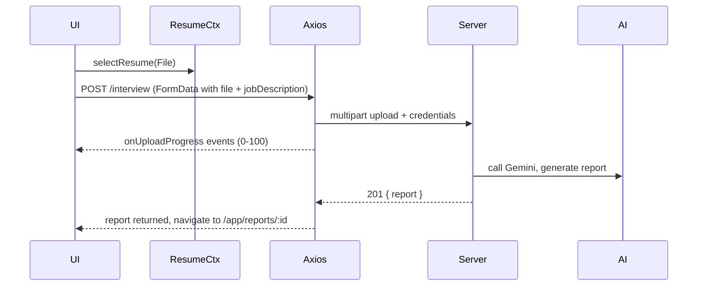

**API Integration**

Client base
- `src/api/client.js` creates an `axios` instance with:
  - `baseURL` from `VITE_API_URL` or `http://localhost:3000/api`
  - `withCredentials: true` so browser cookies (httpOnly JWT) are sent
  - a request interceptor that forwards a locally-stored token (if present) in `Authorization` header
  - a response interceptor that dispatches `SESSION_EXPIRED_EVENT` on 401 responses

Endpoint wrappers
- `src/api/auth.api.js` — `register`, `login`, `logout`, `getMe`, `forgotPassword`, `resetPassword`. These normalize user shapes and handle local token storage for optional bearer tokens.
- `src/api/interview.api.js` — `generateReport` (multipart/form-data with resume file + fields, supports `onUploadProgress`), `listReports`, `getReport`, `deleteReport`.

Error handling
- `client.normalizeError` converts axios errors to `{ message, status, code, retryable }` that pages display.
- Pages present retryable errors with a different title (e.g. AI-service overload).

File upload flow

Security notes
- Because the server sets an httpOnly cookie, the frontend does not need to manage the JWT; localStorage token is optional and forwarded when present.
